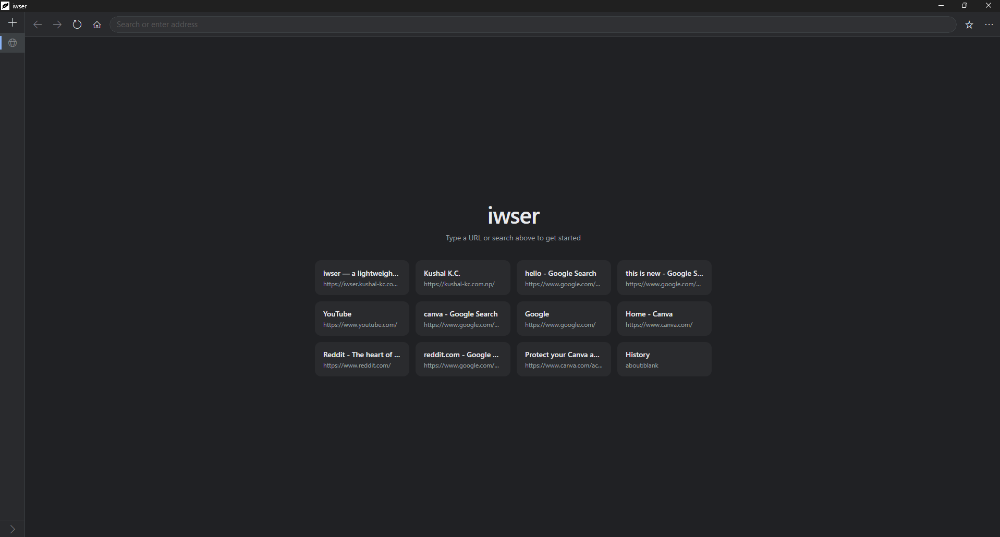

# iwser

A lightweight native Windows web browser built with **C++**, **Win32**, and **Microsoft WebView2**.

**Downlaod:** https://iwser.kushal-kc.com.np/

[](https://iwser.kushal-kc.com.np)

## Features

- Native Win32 interface
- Microsoft WebView2 (Chromium-based)
- Vertical tabs
- Bookmarks and browsing history
- Download manager
- Chrome/Edge unpacked extension support
- Light and dark themes

## Requirements

- Windows 10/11
- Microsoft Edge WebView2 Runtime
- Visual Studio 2022 (C++ workload)
- CMake 3.21+
- Ninja

## Build

```bash
build.bat
```

## Install

```bash
install.bat
```

## Contributors

- https://github.com/Quackzy7
- https://github.com/JENIFKHADKA